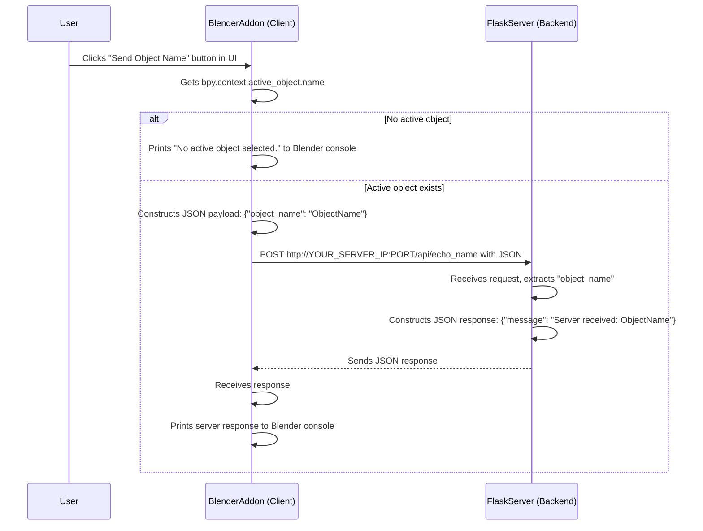

# Blender to Flask: Object Name Echo Application

This document outlines the plan for creating a simple client-server application. The client is a Blender addon, and the server is a Flask application. The goal is to send the name of the currently selected active object from Blender to the Flask server, which then echoes this name back to Blender.

## Objective

*Note: SSH authentication has been set up for this repository.*

Create a minimal setup to demonstrate:
1.  Data extraction from Blender.
2.  Sending data from a Blender addon (client) to a web server.
3.  A simple Flask server (backend) receiving data and sending a response.
4.  The Blender addon receiving the server's response and displaying it.

This project is designed for users new to Flask and client-server networking.

## Components

### 1. Flask Server (Backend - `server.py`)

*   **Framework:** Flask
*   **Functionality:**
    *   A single API endpoint: `/api/echo_name` (accepts POST requests).
    *   Expects a JSON payload: `{"object_name": "YOUR_OBJECT_NAME"}`.
    *   Extracts the `object_name` value.
    *   Returns a JSON response: `{"message": "Server received: YOUR_OBJECT_NAME"}`.
    *   Listens on all available IP addresses (`0.0.0.0`) and port `5000`.
*   **Instructions for Running (Backend - Vast.ai or similar):**
    1.  SSH into your server instance.
    2.  Save the Flask server code as `server.py`.
    3.  Install Flask: `pip install Flask` (include this in comments in `server.py`).
    4.  Run the server: `python server.py` (include this in comments in `server.py`).
    5.  The server will indicate it's running (e.g., `* Running on http://0.0.0.0:5000/`).
    6.  Note the public IP address of your server instance and the port it's running on (e.g., `5000`). Ensure this port is accessible externally. If your hosting provider (like Vast.ai) maps an external port (e.g., `XXXXX`) to your container's internal port `5000`, you will use `YOUR_SERVER_PUBLIC_IP:XXXXX` when configuring the client.

### 2. Blender Addon (Client - `blender_addon.py`)

*   **Functionality:**
    *   A simple Blender panel in the 3D View's "N" panel, titled "Server Test".
    *   A button labeled "Send Object Name".
    *   **Button Click Action:**
        *   Gets the name of `bpy.context.active_object.name`.
        *   If no object is selected, prints "No active object selected." to the Blender system console.
        *   If an object is active, constructs JSON: `{"object_name": "THE_ACTIVE_OBJECT_NAME"}`.
        *   Sends this JSON via POST to the server. The server URL (`http://YOUR_SERVER_IP:PORT/api/echo_name`) is constructed dynamically using the IP address and port configured in the addon's UI panel.
            *   Default IP is `127.0.0.1` and default port is `5000`.
        *   Uses the `urllib.request` library (built-in).
        *   Prints the server's full response (or specific message field) to the Blender system console.
        *   Includes basic `try-except` for network errors (e.g., `requests.exceptions.ConnectionError`).
*   **Structure:**
    *   `bl_info` dictionary.
    *   Operator class for the button.
    *   Panel class for the UI.
    *   `register()` and `unregister()` functions.
*   **Instructions for Use (Client - Your Local Blender):**
    1.  Save the Blender addon code as `blender_addon.py`.
    2.  Open Blender: `Edit > Preferences > Add-ons > Install...` and select `blender_addon.py`. Enable it.
    3.  In Blender's 3D View, add an object (e.g., a Cube) and ensure it's selected.
    4.  Press "N" to open the side panel. Find the "Server Test" panel.
    5.  In the "Server Test" panel, configure the "IP Address" and "Port" fields to match your running Flask server. (Defaults are 127.0.0.1 and 5000 for local testing).
    6.  Click "Send Object Name".
    7.  Open Blender's system console (`Window > Toggle System Console`) to view the server's response.

## Interaction Flow Diagram

## General Requirements for Code (To be generated)

*   Python 3.
*   Complete, runnable code for `server.py` and `blender_addon.py`.
*   Clear comments, especially for networking parts.
*   Minimal and simple code to achieve the described functionality.

This setup will demonstrate the fundamental flow: Blender UI -> Data Extraction -> Network Send (Client) -> Network Receive (Server) -> Processing (Server) -> Network Send (Server) -> Network Receive (Client) -> Display Result.