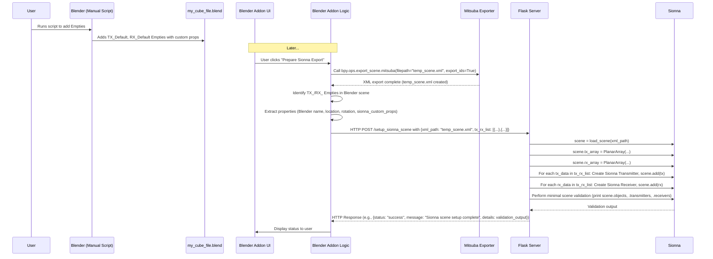

# Phase 2: Integrate Sionna Environment Setup & Basic Data Export (Revised)

**Goals:**

1.  **Blender Setup (One-time preparation):**
    *   Create a simple Blender script to add one "TX\_Default" Empty and one "RX\_Default" Empty to `my_cube_file.blend` (or a working copy).
    *   This script will also add initial custom properties to these Empties:
        *   `TX_Default`:
            *   `sionna_name`: "tx\_from\_blender"
            *   `sionna_pattern`: "iso"
            *   `sionna_polarization`: "V"
            *   `sionna_power_dbm`: 20.0
        *   `RX_Default`:
            *   `sionna_name`: "rx\_from\_blender"
            *   `sionna_pattern`: "iso"
            *   `sionna_polarization`: "V"
2.  **Blender Addon:**
    *   Implement a UI element (e.g., a button "Prepare Sionna Export") in the addon panel.
    *   When triggered, the addon will:
        *   Invoke the Mitsuba addon's scene export: `bpy.ops.export_scene.mitsuba(filepath="temp_scene.xml", export_ids=True)`.
        *   Iterate through scene objects to find Empties whose `name` starts with "TX\_" or "RX\_".
        *   For each found Tx/Rx Empty, collect:
            *   Its Blender name (e.g., "TX\_Default").
            *   Its world-space `location` (as x,y,z).
            *   Its world-space `rotation_euler` (as x,y,z in radians).
            *   All custom properties starting with `sionna_` (e.g., `sionna_name`, `sionna_pattern`, `sionna_power_dbm`).
        *   Package the absolute path to `temp_scene.xml` and the collected Tx/Rx data (as a list of dictionaries, one for each Tx/Rx) into a JSON structure.
        *   Send this JSON package to the Flask server's new endpoint.
3.  **Flask Server:**
    *   Create a new endpoint (e.g., `/setup_sionna_scene`) to receive the JSON package.
    *   From the JSON, get the XML file path and the list of Tx/Rx data dictionaries.
    *   Load the Mitsuba scene from the XML file path: `scene = sionna.rt.load_scene(xml_path)`.
    *   Set default antenna arrays on the Sionna scene:
        *   `scene.tx_array = PlanarArray(num_rows=1, num_cols=1, pattern="iso", polarization="V")`
        *   `scene.rx_array = PlanarArray(num_rows=1, num_cols=1, pattern="iso", polarization="V")`
    *   For each Tx data dictionary received:
        *   Extract `position` (from Blender location).
        *   Extract `name` (from `sionna_name` custom property).
        *   Create a Sionna `Transmitter`: `tx = Transmitter(name=sionna_name, position=blender_location_xyz)`
        *   Add to scene: `scene.add(tx)`.
    *   For each Rx data dictionary received:
        *   Extract `position` (from Blender location).
        *   Extract `name` (from `sionna_name` custom property).
        *   Create a Sionna `Receiver`: `rx = Receiver(name=sionna_name, position=blender_location_xyz)`
        *   Add to scene: `scene.add(rx)`.
    *   Perform a minimal Sionna operation: `print(f"Sionna scene objects: {scene.objects}")`, `print(f"Sionna transmitters: {scene.transmitters}")`, `print(f"Sionna receivers: {scene.receivers}")`.
    *   Send an acknowledgment/status (e.g., the print outputs or a success message) back to the Blender addon.

**Workflow Diagram (Mermaid):**

**Key Considerations & Definitions:**

*   **Tx/Rx Empty Naming Convention:** Names starting with `TX_` for transmitters and `RX_` for receivers.
*   **Custom Properties for Tx/Rx Empties:** Prefixed with `sionna_` (e.g., `sionna_name`, `sionna_pattern`, `sionna_power_dbm`).
*   **XML File Management:** Blender addon saves to `temp_scene.xml`, path sent to server.
*   **Initial Sionna Operation:** Server loads scene, adds Tx/Rx, prints basic scene info for verification.