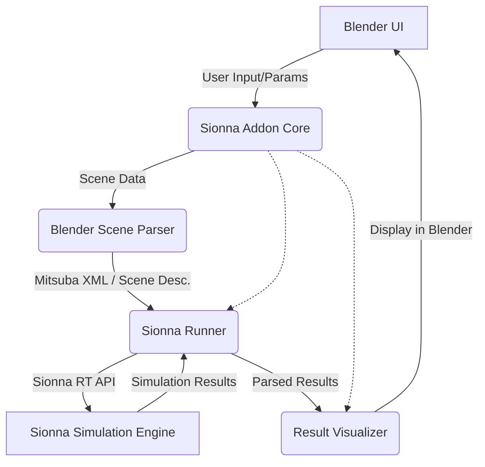

# Blender-Sionna Integration: Phased Development Plan

## 1. Introduction

The long-term vision is to create a Blender addon that allows users to seamlessly perform Sionna raytracing simulations directly from their Blender scenes. This document outlines a phased development approach, starting with foundational baby steps and gradually building towards a comprehensive tool.

## 2. Current Status & Foundation

Based on `blender-sionna/README.md`, a foundational Blender addon exists that can:
*   Display a UI panel.
*   Trigger an operator from a button.
*   Extract basic data from Blender (active object name).
*   Communicate with an external Flask server (send data and receive a response).

This existing work provides a solid base for UI elements, operator handling, and potentially for triggering external Python scripts (which will be essential for running Sionna).

## 3. Core Sionna RT Concepts for Blender Integration

From the Sionna RT tutorials, key functionalities relevant for Blender integration include:
*   **Scene Loading & Representation:** Sionna RT (via Mitsuba 3) primarily uses an XML-based scene description. Blender scenes will need to be parsed and translated into this format.
*   **Scene Objects:** Blender objects (meshes, materials, transforms) need to map to Sionna `SceneObject` equivalents with appropriate `RadioMaterial` properties.
*   **Transmitters (Tx) and Receivers (Rx):** Users will need to define Tx/Rx entities within Blender, which then translate to Sionna `Transmitter` and `Receiver` objects with specific positions, orientations, and antenna configurations.
*   **Path Solving:** Utilizing Sionna's `PathSolver` to compute propagation paths (LoS, reflections, diffractions, scattering).
*   **Radio Maps:** Generating and visualizing `RadioMap`s for coverage analysis.
*   **Parameterization:** Exposing relevant Sionna simulation parameters (e.g., `max_depth`, frequency, antenna types, material properties) through the Blender UI.
*   **Result Visualization:** Displaying Sionna outputs (ray paths, radio maps, channel data) back within the Blender environment.

## 4. Proposed Development Phases & Milestones

We will approach this with a series of iterative phases, starting with simple integrations and building complexity.

### Phase 0: Leverage Existing Foundation

*   **Goal:** Ensure the current addon structure can trigger local Python scripts that utilize Sionna.
*   **Tasks:**
    *   Verify that the existing addon can execute a simple, local Python script (outside of Flask communication).
*   **Milestone:** Blender addon can successfully run a basic Python script that prints to the console.

### Phase 1: "Hello Sionna World" - Minimal Sionna Script Execution

*   **Goal:** Trigger a predefined, simple Sionna RT script from a Blender button.
*   **Tasks:**
    1.  Create a button in the Blender addon UI (e.g., "Run Simple Sionna Test").
    2.  This button will execute a Python script.
    3.  The Python script will:
        *   Import `sionna.rt`.
        *   Load a built-in Sionna scene (e.g., `sionna.rt.scene.munich` or `sionna.rt.scene.simple_reflector`).
        *   Perform a minimal Sionna action (e.g., `scene.render_to_file(...)` or compute paths for a hardcoded Tx/Rx and print path count).
        *   Log success or basic output to the Blender system console.
*   **Milestone:** Blender successfully triggers a Sionna RT script that loads a scene and performs a basic operation, with feedback in the Blender console.

### Phase 2: "Export One Cube" - Basic Blender Geometry to Sionna

*   **Goal:** Export a single, simple Blender object's geometry to a Sionna-compatible format (minimal Mitsuba XML) and use it in a basic Sionna simulation.
*   **Tasks:**
    1.  Add an operator: "Export Active Object & Simulate".
    2.  Blender Python script to:
        *   Get the active Blender object.
        *   Extract basic mesh data (vertices, faces) for a simple object (e.g., a default Cube).
        *   Write a *minimal* Mitsuba XML file representing this single object. (Initially, assign a default placeholder material like `<bsdf type="diffuse"/>`).
    3.  Sionna Python script (triggered by Blender) to:
        *   Load the generated XML scene.
        *   Add a hardcoded `Transmitter` and `Receiver` to the scene.
        *   Run `PathSolver` (e.g., `max_depth=1`).
        *   Print the number of found paths or basic path information to the Blender console.
*   **Milestone:** A single Blender object's geometry is successfully exported, loaded by Sionna, and used in a ray tracing simulation.

### Phase 3: "Place Your Emitters" - Parameterizing Tx/Rx from Blender

*   **Goal:** Allow the user to define Tx and Rx positions in Blender (e.g., using Blender Empties) and use these in a Sionna simulation with a simple scene (e.g., the exported cube from Phase 2 or a fixed simple background scene).
*   **Tasks:**
    1.  Establish a convention for identifying Tx/Rx Empties in Blender (e.g., specific names like "SionnaTX.001", "SionnaRX.001", or custom properties on Empties).
    2.  Blender UI to list/manage these designated Tx/Rx Empties.
    3.  Blender script to:
        *   Identify designated Tx/Rx Empties.
        *   Extract their world-space positions (and potentially orientations later).
        *   Pass these coordinates to the Sionna simulation script (e.g., via command-line arguments, a temporary JSON file, or if the Sionna script is part of the addon, directly).
    4.  Sionna script to:
        *   Receive Tx/Rx coordinates.
        *   Instantiate `sionna.rt.Transmitter` and `sionna.rt.Receiver` objects at these positions.
        *   Use these in a simulation (e.g., with the scene from Phase 2).
        *   Print confirmation or results to the Blender console.
*   **Milestone:** Tx/Rx positions defined in Blender are used to configure and run a Sionna simulation.

### Phase 4: "See the Rays" - Basic Result Visualization in Blender (Simplified)

*   **Goal:** After a simple simulation (e.g., LoS path from Phase 3), visualize the primary path(s) within the Blender 3D viewport.
*   **Tasks:**
    1.  Sionna script to:
        *   Compute paths (e.g., for one Tx/Rx pair).
        *   Extract coordinates for a few key paths (e.g., LoS path: Tx position, Rx position; First-order reflection: Tx, bounce point, Rx).
        *   Output these coordinates (e.g., to a simple text or JSON file).
    2.  Blender script to:
        *   Read the path coordinate data.
        *   Create new Blender objects (e.g., mesh edges/polylines, or Grease Pencil strokes) to represent these paths in the 3D view.
*   **Milestone:** Basic visual feedback of Sionna-computed ray paths is displayed within the Blender environment.

## 5. Long-Term Architectural Considerations

As the addon grows, a modular architecture will be crucial.

*   **`BlenderUI`**: Manages all user interface elements (panels, buttons, properties) within Blender.
*   **`BlenderSceneParser`**: Responsible for:
    *   Traversing the Blender scene graph.
    *   Converting Blender objects (meshes, materials, lights, cameras, empties for Tx/Rx) into a Sionna/Mitsuba-compatible scene description (likely XML).
    *   Handling coordinate system transformations.
    *   Mapping Blender materials to Sionna `RadioMaterial` properties (this will be a significant challenge requiring a flexible mapping system).
*   **`SionnaRunner`**:
    *   Takes the scene description and simulation parameters (from UI).
    *   Constructs and executes Sionna RT API calls (`PathSolver`, `RadioMapSolver`, etc.).
    *   Manages the Sionna simulation process.
    *   Captures and preprocesses simulation output (paths, CIR/CFR data, radio maps).
*   **`ResultVisualizer`**:
    *   Takes processed Sionna results.
    *   Creates visual representations within Blender (e.g., drawing ray paths, generating meshes for radio maps, displaying plots in UI panels).

## 6. Future Phases (High-Level Outline)

Beyond the initial baby steps, development could proceed through:

*   **Phase 5: Comprehensive Scene Export:** Support for multiple objects, complex meshes, object hierarchy, basic Blender material to Sionna `RadioMaterial` mapping.
*   **Phase 6: Advanced Parameterization & Antenna Configuration:** UI for detailed Sionna parameters (solver settings, frequencies, `RadioMaterial` properties), defining antenna patterns and arrays from Blender.
*   **Phase 7: Radio Map Computation & Visualization:** Integrate `RadioMapSolver`, display radio maps (e.g., as textured planes or vertex colors) in Blender.
*   **Phase 8: Mobility & Dynamic Scenes:** Incorporate object velocities from Blender animations for Doppler calculations and time-evolved channel simulations.
*   **Phase 9: Usability & Workflow:** Scene/project management for Sionna settings within Blender files, error handling, progress reporting, performance optimization, documentation.

## 7. Conclusion

This phased approach aims to deliver incremental value, allowing for testing and refinement at each stage. The initial phases focus on establishing the core link between Blender and Sionna, progressively adding features to realize the vision of a powerful, integrated raytracing tool for wireless communications research and visualization within Blender.